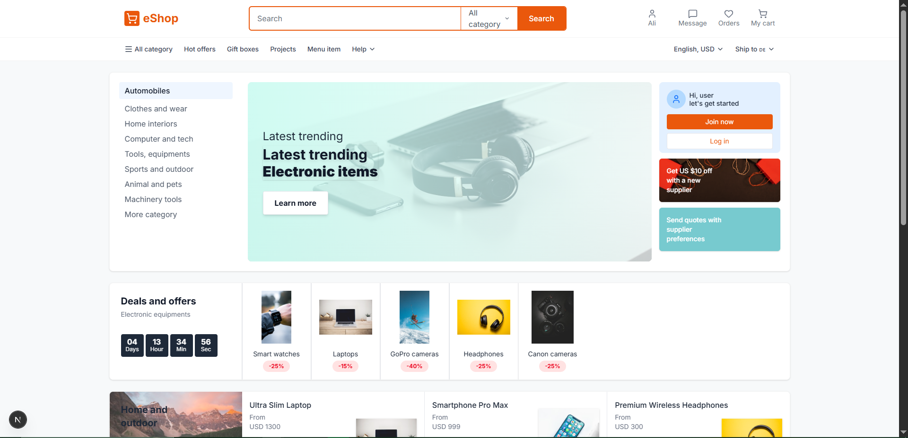
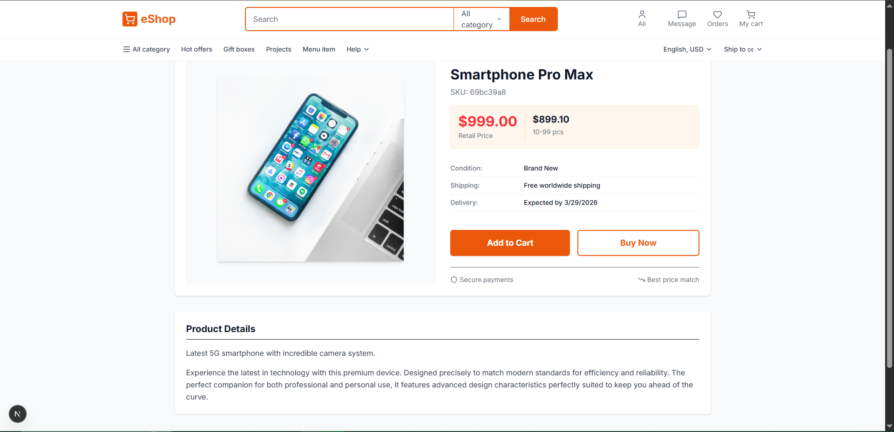
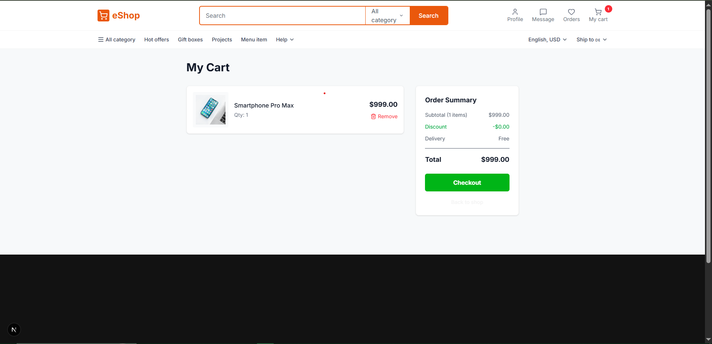
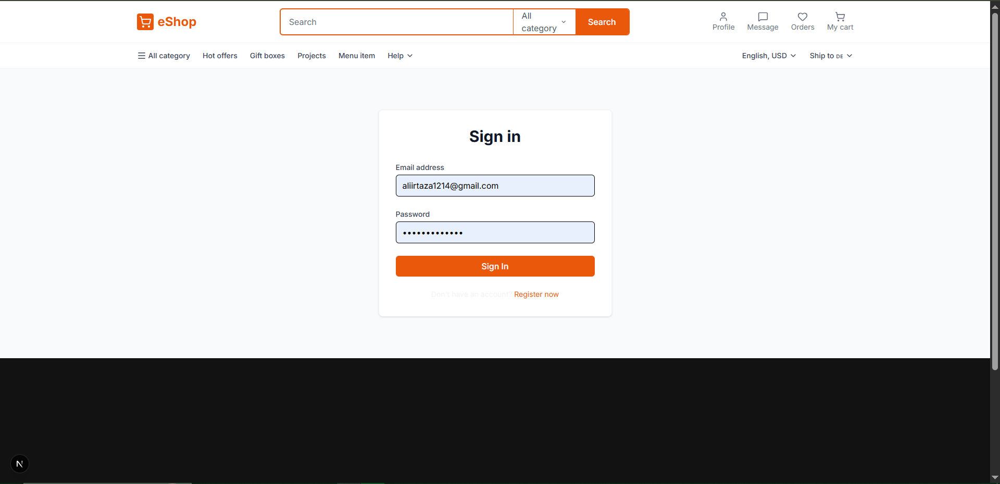
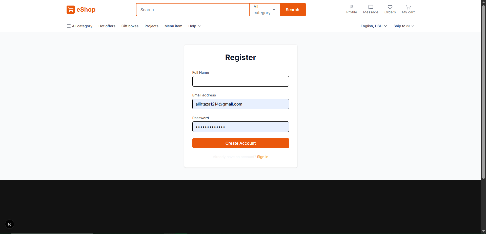

# eShop – Full Stack E-Commerce Web Application

A fully responsive full-stack e-commerce web application built as part of an internship at **Developers Hub Corporation**.

**Made by Ali Irtaza** — *Full Stack Developer Intern at Developers Hub Corporation*

---

## 🚀 Tech Stack

| Layer | Technology |
|---|---|
| Frontend | Next.js 16, Tailwind CSS v4, TypeScript |
| Backend | Node.js, Express.js |
| Database | MongoDB (via Mongoose) |
| Auth | JWT (JSON Web Tokens), bcryptjs |
| Styling | Orange & White theme, Responsive Design |

---

## ✨ Features

- **Home Page** – Hero banner with latest trending electronics, deals section with countdown, category grids (Home & Outdoor, Consumer Electronics), and product recommendations
- **Product Detail Page** – Individual product pages with image, pricing tiers, shipping info, Add to Cart / Buy Now
- **User Authentication** – Register, Login with JWT-based session management
- **Shopping Cart** – Add items, view cart, checkout flow
- **Admin Panel** – CRUD operations for product management (admin-only)
- **Responsive Design** – Fully optimized for desktop and mobile views
- **Dynamic Data** – All products fetched live from MongoDB via REST API

---

## 🖼️ Screenshots

### Desktop Views

| Home Page | Home (Scrolled) |
|---|---|
|  | .png) |

| Product Detail | Cart |
|---|---|
|  |  |

| Login | Register |
|---|---|
|  |  |

---

### 📱 Mobile Views

| Home | Home (Scrolled) |
|---|---|
|  | .jpeg) |

| Product Detail | Product Detail (Scrolled) |
|---|---|
|  | .jpeg) |

| Login | Cart |
|---|---|
|  |  |

---

## 📁 Project Structure

```
ecommerce-web-app/
├── Screenshots/              # Desktop and mobile view screenshots
│   └── mobile view/          # Mobile-specific screenshots
├── backend/                  # Node.js + Express API
│   ├── models/               # Mongoose schemas (User, Product, Cart)
│   ├── routes/               # API route handlers
│   ├── middleware/           # Auth + Admin middleware
│   └── server.js             # Entry point
│
└── frontend/                 # Next.js App
    └── src/
        ├── app/              # Pages (home, login, register, cart, product/[id], admin)
        ├── components/       # Reusable UI components
        │   ├── home/         # HeroSection, DealsSection, CategoryGridSection, etc.
        │   └── layout/       # Navbar, Footer
        └── context/          # Auth + Cart React Context providers
```

---

## ⚙️ Getting Started

See [WALKTHROUGH.md](WALKTHROUGH.md) for a detailed step-by-step guide to running the application.

### Quick Start
```bash
# Clone the repo
git clone https://github.com/aliirtaza58/ecommerce-fullstack-design.git
cd ecommerce-fullstack-design

# Backend
cd backend && npm install
# Create .env (see WALKTHROUGH.md for details)
node server.js

# Frontend (new terminal)
cd frontend && npm install && npm run dev
```

Open [http://localhost:3000](http://localhost:3000) in your browser.

---

## 🔑 API Endpoints

### Auth
| Method | Endpoint | Description |
|---|---|---|
| POST | `/api/auth/register` | Register a new user |
| POST | `/api/auth/login` | Login and get JWT token |
| GET | `/api/auth/profile` | Get logged-in user profile |

### Products
| Method | Endpoint | Description |
|---|---|---|
| GET | `/api/products` | Get all products |
| GET | `/api/products/:id` | Get single product |
| POST | `/api/products` | Create product *(admin only)* |
| PUT | `/api/products/:id` | Update product *(admin only)* |
| DELETE | `/api/products/:id` | Delete product *(admin only)* |

### Cart
| Method | Endpoint | Description |
|---|---|---|
| GET | `/api/cart` | Get user's cart |
| POST | `/api/cart/save` | Save cart to database |

---

## 👤 Author

**Ali Irtaza**
*Full Stack Developer Intern*
*Developers Hub Corporation*
